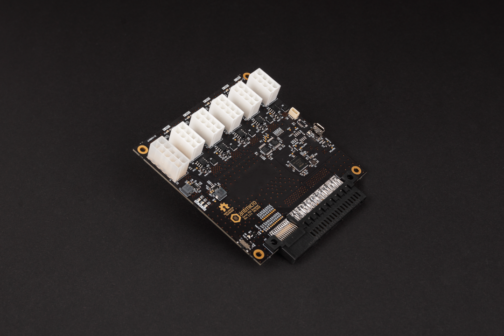

# Antmicro's open source D1600E PSU Breakout

Copyright (c) 2022 [Antmicro](https://www.antmicro.com)

## Overview

This repository contains open hardware design files for a Power Supply Unit (PSU) breakout board compatible with [Dell D1600E-S0 PSU](https://www.dell.com/en-us/work/shop/dell-power-supply-ac-1600-watt-psu-io/apd/450-ahuc/computer-chassis-components). 
The design files were prepared in KiCad.

## Repository structure

The main repository directory contains KiCAD PCB project files, a LICENSE and README. The remaining files are stored in the following directories:
- `lib` - contains the component libraries
- `img` - contains graphics for this README

## Key features

* 5x power output channels providing 12V over 8-pin PCI Express type (Molex/39288080) sockets
* Up to 220W per single 12V power output channel
* Output current measurement implemented with [Ti/TMCS1100A2QDRQ1](https://www.ti.com/lit/ds/symlink/tmcs1100-q1.pdf) Hall sensors and 12-bit [Ti/ADS7828E](https://www.ti.com/lit/ds/symlink/ads7828.pdf) ADC accessible over I2C
* Power-cycling for each channel implemented with power MOSFETS driven from [Ti/TCA9534](https://www.ti.com/lit/ds/symlink/tca9534.pdf) GPIO expander accessible over I2C 
* I2C bus for current measurements and power cycling is opto-coupled with [FTDI/FT4232H-56Q](https://www.ftdichip.com/Support/Documents/DataSheets/ICs/DS_FT4232H.pdf) with USB exposed towards an external host
* Auxilary connector (Molex/39281103) exposing 5.0V,3.3V,12V for connecting external peripherals

## License

[Apache-2.0](LICENSE)
