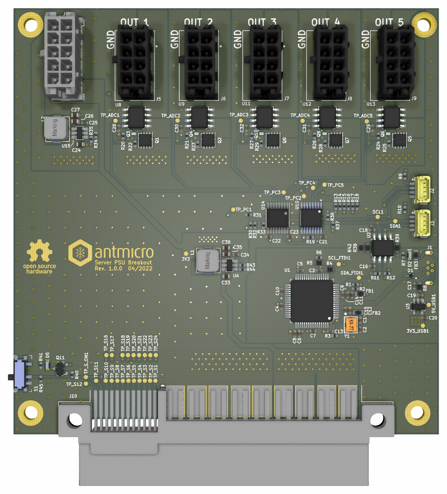

# Antmicro's open source Server PSU Breakout

Copyright (c) 2022 [Antmicro](https://www.antmicro.com)

## Overview

This repostitory contains open hardware design files for [Dell D1600E-S0 PSU](https://www.dell.com/en-us/work/shop/dell-power-supply-ac-1600-watt-psu-io/apd/450-ahuc/computer-chassis-components) server breakout board. 

The design files were prepared in KiCAD.

## Repository structure

The main repository directory contains KiCAD PCB project files, a LICENSE and README. The remaining files are storef in the following directories:
- `lib` - contains the component libraries
- `img` - contains graphics for this README

## Key features

- Up to 220W per single channel
- 5x 8-pin PCIe sockets 
- Single 10-pin socket
- Galvanically separated high current side
- Power cycling 
- Power consumption measurement
- Controlled via USB
